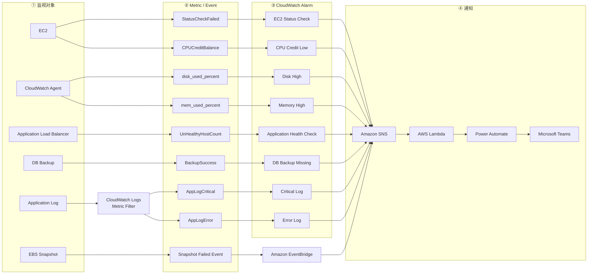
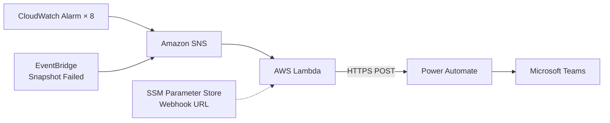

# AWS

AWS 是 Amazon Web Services（亚马逊云服务），是 Amazon 提供的一整套云计算服务，和 GCP、Microsoft Azure 属于同一类平台，也是目前市场份额最大的公有云。

## 资源层级

AWS 的资源按下面这条链组织，权限（IAM）在 Account 内生效，SCP（服务控制策略）从 Organization / OU 向下限制：

```
Organization（组织）
  └─ OU（组织单元，可选）
       └─ Account（账号）
            └─ Region（区域）
                 └─ Resource（EC2 / S3 桶 / RDS …）
```

**Account 是最核心的隔离单位**：计费、配额、IAM 权限都以账号为边界，通常按 `dev / staging / prod` 拆成多个账号。此外 **绝大多数资源属于某个 Region**，日常操作前先确认「当前在哪个账号、哪个区域」，这是最容易踩坑的地方。

> 常用区域：`ap-northeast-1`（东京）、`ap-northeast-3`（大阪）、`us-east-1`（弗吉尼亚，很多全局服务的控制面在这里）。

## 常用服务

| 分类 | 服务 | 说明 |
|---|---|---|
| **计算** | EC2 | 虚拟机 |
| **计算** | ECS / Fargate | 容器编排，Fargate 为免服务器模式 |
| **计算** | App Runner | 容器化的 Serverless 服务，最接近 Cloud Run |
| **计算** | EKS | 托管 Kubernetes |
| **计算** | Lambda | 函数级 Serverless |
| **计算** | Batch | 批处理任务 |
| **存储** | S3 | 对象存储 |
| **存储** | EBS / EFS | 块存储 / 共享文件系统 |
| **数据库** | RDS / Aurora | 托管 MySQL / PostgreSQL / SQL Server |
| **数据库** | DynamoDB | 键值型 NoSQL |
| **数据库** | Redshift / Athena | 数据仓库 / 直接查询 S3 |
| **网络** | VPC / ELB / Route 53 | 网络、负载均衡、DNS |
| **网络** | CloudFront | CDN |
| **消息** | SQS / SNS / EventBridge | 队列 / 主题订阅 / 事件总线 |
| **CI/CD** | CodeBuild / CodePipeline | 构建与发布流水线 |
| **CI/CD** | ECR | 容器镜像仓库 |
| **权限** | IAM / IAM Identity Center | 账号、角色、权限管理 / SSO |
| **运维** | CloudWatch | 日志、指标、告警 |
| **运维** | CloudFormation | 基础设施即代码（也常用 Terraform）|
| **安全** | Secrets Manager / Parameter Store | 密钥、配置管理 |
| **安全** | KMS | 加密密钥管理 |

## 认证方式

| 方式 | 场景 |
|---|---|
| IAM Identity Center（SSO） | 本地开发的首选，凭据自动过期，无长期密钥 |
| IAM User + Access Key | 传统方式，长期凭据，仅在无法用 SSO 时使用 |
| IAM Role（AssumeRole） | 跨账号访问、EC2 / ECS / Lambda 上的服务身份 |
| OIDC Federation | GitHub Actions 等 CI 免密钥接入，优先选它 |

> 注意：Access Key（`AKIA...`）属于长期凭据，泄露风险高。能用 SSO 或 OIDC 就不要生成 Access Key，更不要提交进仓库。

## 配置文件

CLI 的凭据与配置分别放在这两个文件，按 profile 区分账号／环境：

```
~/.aws/credentials   # Access Key 等凭据
~/.aws/config        # region、output、SSO、role 等配置
```

切换 profile 用 `--profile xxx` 参数，或设置环境变量 `AWS_PROFILE=xxx`。

---

# AWS CLI

官方安装文档：https://docs.aws.amazon.com/zh_cn/cli/latest/userguide/getting-started-install.html

## 安装（Linux x86_64 / WSL）

### 1. 安装基础依赖

```bash
sudo apt-get update
sudo apt-get install -y curl unzip
```

### 2. 下载 AWS CLI v2 安装包

```bash
cd ~
curl "https://awscli.amazonaws.com/awscli-exe-linux-x86_64.zip" -o "awscliv2.zip"
```

### 3. 解压

```bash
unzip awscliv2.zip
```

### 4. 执行安装

```bash
sudo ./aws/install
```

> 已经装过要升级时，追加 `--update`：`sudo ./aws/install --update`

### 5. 确认

```bash
aws --version
```

### 6. 安装过后目录清理

```bash
rm -rf aws awscliv2.zip
```

## 登录

### 方式 A：IAM Identity Center（SSO，推荐）

首次配置，按提示填入 SSO start URL、区域、账号与角色：

```bash
aws configure sso
```

之后每次凭据过期，重新登录即可。WSL 里没浏览器时加 `--no-browser`，会给你一个 URL，复制到 Windows 浏览器授权后回到终端确认：

```bash
aws sso login --no-browser
```

### 方式 B：Access Key

交互式填入 Access Key ID / Secret Access Key / 默认区域 / 输出格式：

```bash
aws configure
```

## 认证与配置确认

确认当前认证身份（账号 ID、IAM ARN）：

```bash
aws sts get-caller-identity
```

检查当前配置：

```bash
aws configure list
```

查看有哪些 profile：

```bash
aws configure list-profiles
```

## 账号与区域操作

查看组织下所有账号（需要 Organizations 权限）：

```bash
aws organizations list-accounts
```

设定默认区域：

```bash
aws configure set region ap-northeast-1
```

指定 profile 执行命令：

```bash
aws sts get-caller-identity --profile xxx
```

## 资源查看

查看该账号下所有 EC2 实例：

```bash
aws ec2 describe-instances
```

只看实例 ID、名称、状态：

```bash
aws ec2 describe-instances --query "Reservations[].Instances[].{ID:InstanceId,Name:Tags[?Key=='Name']|[0].Value,State:State.Name}" --output table
```

查看所有 S3 存储桶：

```bash
aws s3 ls
```

查看所有 Lambda 函数：

```bash
aws lambda list-functions --query "Functions[].FunctionName" --output table
```

查看所有 ECS 集群：

```bash
aws ecs list-clusters
```

查看指定集群下的 ECS 服务：

```bash
aws ecs list-services --cluster xxx
```

查看所有 RDS 实例：

```bash
aws rds describe-db-instances --query "DBInstances[].{ID:DBInstanceIdentifier,Engine:Engine,Status:DBInstanceStatus}" --output table
```

---

# 认证信息的处理

实际做多环境构建时踩过的东西，整理成惯例。核心只有一句：**凭据不落地、身份先确认、破坏要往安全的方向坏。**

## 绝不进仓库的东西

| 类别 | 具体 |
|---|---|
| AWS 凭据 | Access Key ID / Secret Access Key / Session Token |
| 密码 | 数据库密码、检索引擎的 master 密码、任何 `*_PASSWORD` |
| Secret 值 | Secrets Manager 里存的内容本身 |
| 证书 | 私钥、`.pem`、`.key` |
| SSO 缓存 | `~/.aws/sso/cache/` 下的 token |

> CLI 的执行结果里如果混进了上面这些，不要原样粘贴到文档／Issue／聊天里。

Account ID 和 Resource ARN 属于「不是机密但也别到处贴」的档次 —— 它们不能直接用来登录，但是攻击者做侦察的起点（知道 Account ID 就能推出 Role ARN 的完整形式）。**要看仓库的公开范围来决定记不记**。内部仓库可以记，要交付给第三方的话用占位符。

## 多环境的 profile 组织

### sso-session 与 profile 分离

多个账号共用同一个 SSO 门户时，把「登录信息」和「账号信息」拆开写：登录一次，所有 profile 都能用。

```ini
# ~/.aws/config

[sso-session mycompany]
sso_start_url = https://d-xxxxxxxxxx.awsapps.com/start
sso_region = ap-northeast-1
sso_registration_scopes = sso:account:access

[profile dev]
sso_session = mycompany
sso_account_id = 111111111111
sso_role_name = AWSAdministratorAccess
region = ap-northeast-1
output = json

[profile prod]
sso_session = mycompany
sso_account_id = 222222222222
sso_role_name = AWSAdministratorAccess
region = ap-northeast-1
output = json
```

登录时指定 session 而不是 profile，一次登录覆盖所有账号：

```bash
aws sso login --sso-session mycompany
```

### 非交互式配置

`aws configure sso` 是交互式的，要一路回答问题。已经知道所有值的话，直接追加进配置文件更快，也方便写进手册让别人照抄：

```bash
cat >> ~/.aws/config <<'EOF'

[profile prod]
sso_session = mycompany
sso_account_id = 222222222222
sso_role_name = AWSAdministratorAccess
region = ap-northeast-1
output = json
EOF
```

### 作业开始时固定 profile

命令里每次写 `--profile` 容易漏，漏了就打到默认账号去了。开工先固定：

```bash
export AWS_PROFILE=dev
export AWS_PAGER=""      # v2 默认把输出送进 less，粘贴结果时很碍事
```

> 环境变量只在当前终端有效。**重开终端就没了** —— 之后的命令会静默地打到别的账号。养成重开终端就重设的习惯。

## CloudWatch

CloudWatch 是 AWS 提供的监控与可观测性服务，可用于集中收集日志、查询日志、监控 Metrics，以及配置 Alarm 和通知。

### EC2 场景

对于 **EC2 + Docker Compose** 应用，推荐应用只向 `stdout / stderr` 输出日志，由 Docker 的 `awslogs` logging driver 直接发送到 CloudWatch Logs，不需要在业务容器中安装 CloudWatch Agent。

```
Application → stdout / stderr → Docker daemon → awslogs → CloudWatch Logs
```

### Docker Compose 配置示例

```yaml
services:
  app:
    image: demo/app:latest
    logging:
      driver: awslogs
      options:
        mode: non-blocking                    # CloudWatch 异常时不阻塞应用
        max-buffer-size: 8m                   # 日志缓冲区，可按日志量调整
        awslogs-region: ap-northeast-1
        awslogs-group: /demo-dev/demo-app     # CloudWatch Log Group
        awslogs-create-group: "true"          # Log Group 不存在时自动创建
        tag: "{{.Name}}"                      # Container Name 作为 Log Stream
```

### 日志传输原理

Docker daemon 会捕获容器主进程的 `stdout / stderr`，配置 `awslogs` 后，由 Docker 负责调用 CloudWatch Logs API 上传日志，应用本身不需要实现日志上传逻辑。

```
Application → stdout / stderr → Docker daemon → CloudWatch Logs API → CloudWatch Logs
```

### Log Group / Log Stream 设计

CloudWatch Logs 主要分为两层：

```
/demo-dev/demo-app     ← Log Group
├── demo-app-1         ← Log Stream
├── demo-nginx-1
└── demo-worker-1
```

* **Log Group**：一个项目 / 环境 / 应用的日志集合，推荐命名 `/{project}-{environment}/{application}`
* **Log Stream**：具体 Container 的日志流，推荐使用 Container Name，方便识别和查询

例如：`/demo-dev/demo-app`、`/demo-stg/demo-app`、`/demo-prd/demo-app`

### 推荐使用 non-blocking

`non-blocking` 会在 Application 和 CloudWatch 之间增加 Docker Buffer：

```
Application → Docker Log Buffer → CloudWatch Logs
```

CloudWatch 短暂异常时，日志会暂存在 Buffer 中；如果 Buffer 最终写满，部分日志可能被丢弃，但不会因为日志上传异常持续阻塞应用。

> **宁可在极端情况下丢失部分日志，也不要因为日志系统异常影响业务请求。**

`max-buffer-size: 8m` 是 Buffer 大小，可根据项目实际日志量调整。

### awslogs 与 CloudWatch Agent 的区别

| 项目                     | Docker `awslogs` | CloudWatch Agent |
| ---------------------- | ---------------- | ---------------- |
| Docker stdout / stderr | ◎                | ○                |
| EC2 系统日志               | ×                | ◎                |
| 自定义日志文件                | ×                | ◎                |
| Memory / Disk Metrics  | ×                | ◎                |
| 配置复杂度                  | 低                | 较高               |

只需要 **Docker stdout/stderr → CloudWatch Logs** 时，优先使用 Docker `awslogs` driver；如果还需要采集 **EC2 Memory、Disk、系统日志、自定义日志文件**等，则考虑 CloudWatch Agent。

### ECS Fargate 场景

ECS Fargate 不需要管理 EC2 或 Docker daemon。推荐应用只向 `stdout / stderr` 输出日志，在 **ECS Task Definition** 中配置 `awslogs`，由 Fargate 将日志发送到 CloudWatch Logs。

```
Application → stdout / stderr → ECS Fargate → awslogs → CloudWatch Logs
```

Task Definition 配置示例：

```json
{
  "logConfiguration": {
    "logDriver": "awslogs",
    "options": {
      "awslogs-region": "ap-northeast-1",
      "awslogs-group": "/demo-prd/demo-app",
      "awslogs-stream-prefix": "app"
    }
  }
}
```

对于普通应用日志，直接使用 **`awslogs`** 即可。如果需要日志过滤、加工、同时发送到多个目的地（CloudWatch / S3 / OpenSearch 等），可以考虑 **FireLens + Fluent Bit**。

```text
简单场景：Application → awslogs → CloudWatch Logs
复杂场景：Application → FireLens / Fluent Bit → CloudWatch / S3 / OpenSearch
```

# AWS 监视运维

## 1. 监视整体构成

一个监视链路通知到 Microsoft Teams 的例子



其中 EBS Snapshot 失败与其他监视不同，不经过 CloudWatch Alarm，而是由 EventBridge 直接发送到 SNS。

---

## 2. 实际监视项目

| # | 监视对象              | AWS Metric / Event             | 监视内容                   |
| - | ----------------- | ------------------------------ | ---------------------- |
| 1 | EC2               | `StatusCheckFailed`            | EC2 Instance / Host 异常 |
| 2 | EC2               | `CPUCreditBalance`             | Burst CPU Credit 不足    |
| 3 | Disk              | `disk_used_percent`            | 磁盘使用率过高                |
| 4 | Memory            | `mem_used_percent`             | 内存使用率过高                |
| 5 | ALB / Application | `UnHealthyHostCount`           | Application 无法正常响应     |
| 6 | DB Backup         | Custom Metric `BackupSuccess`  | 一定时间内没有成功 Backup       |
| 7 | Application Log   | Custom Metric `AppLogCritical` | `CRITICAL` Log 出现      |
| 8 | Application Log   | Custom Metric `AppLogError`    | `ERROR` Log 出现         |
| 9 | EBS Snapshot      | EventBridge Event              | Snapshot 创建失败          |

最终创建了 8 个 CloudWatch Alarm，另外增加了 1 个 EventBridge 监视。

---

## 3. 通知链路

所有 CloudWatch Alarm 共用同一个通知链路。



Lambda 负责把 SNS Message 转换成 Teams 可以显示的 Adaptive Card。

Webhook URL 保存在 SSM Parameter Store 的 `SecureString` 中，不直接写入代码。

---

## 4. 异常发生到 Teams 到达的时间

「Metric 的收集间隔」和「CloudWatch Alarm 的评价周期」是不同的。

| Alarm               | Metric 间隔 |  Period | 判定条件     | 异常 → Teams |
| ------------------- | --------: | ------: | -------- | ---------: |
| `ec2-status-check`  |      60 秒 |    60 秒 | 2/2 连续   |     约 3 分钟 |
| `app-healthcheck`   |      60 秒 |    60 秒 | 3 次中 2 次 |     约 3 分钟 |
| `cpu-credits-low`   |      5 分钟 |   300 秒 | 3/3 连续   |    约 16 分钟 |
| `db-backup-missing` |        每日 | 86400 秒 | 1/1      |     约 7 小时 |
| `disk-high`         |      60 秒 |   300 秒 | 2/2 连续   |    约 11 分钟 |
| `memory-high`       |      60 秒 |   300 秒 | 3/3 连续   |    约 16 分钟 |
| `log-critical`      |   Log 到达时 |   300 秒 | 1/1      |     约 6 分钟 |
| `log-error`         |   Log 到达时 |   300 秒 | 1/1      |     约 6 分钟 |
| `snapshot-failed`   | Event 发生时 |       — | —        |     约 1 分钟 |

## AWS 架构图标
https://aws.amazon.com/cn/architecture/icons/

## CIDR计算器
计算网段里面有多少个IP地址

https://cidr.xyz/

## AWS 架构图

- 经典架构1 [aws-classic-1.drawio](./drawio/aws-classic-1.drawio)
- 经典架构2 [aws-classic-2.drawio](./drawio/aws-classic-2.drawio)

## MinIO
MinIO 是一个高性能、开源的 S3 兼容对象存储系统，可用于自建类似 Amazon S3 的存储服务，常用于文件、备份、日志以及 AI/大数据数据集的存储。

https://github.com/minio/minio

```bash
docker run -d \
  --name minio \
  -p 9000:9000 \
  -p 9001:9001 \
  -e MINIO_ROOT_USER=user \
  -e MINIO_ROOT_PASSWORD=password123 \
  -v minio-data:/data \
  minio/minio:RELEASE.2025-04-22T22-12-26Z \
  server /data --console-address :9001
```

- 端口9000：S3 API，程序通过该端口访问 MinIO，对象上传、下载等操作都使用这个端口
- 端口9001：MinIO Web 管理界面

http://localhost:9001/


## Localstack(已经不维护了)

Localstack 是开发 JIRA 的公司 Atlassian 开发的, 用 Python ``山寨`` 了 AWS 的 API, 通过 REST API 提供跟 AWS 一模一样的服务

它 是一个云服务模拟器，可在笔记本电脑或 CI 环境中的单个容器中运行。使用 LocalStack，您可以完全在本地计算机上运行 AWS 应用程序或 Lambda，而无需连接到远程云提供商

- [Github官网](https://github.com/localstack/localstack)
- [Localstack官网](https://docs.localstack.cloud/overview/)
- [DockerHub官网](https://hub.docker.com/r/localstack/localstack)
- [使用 LocalStack 和 Docker 开发和测试 AWS 云应用程序](https://docs.docker.com/guides/localstack/)

### Localstack Docker 启动
使用命令
```bash
# 拉取社区版镜像(1.15GB 左右), 社区版映像可免费使用不需要许可证
docker pull localstack/localstack:latest
# localstack/localstack-pro:latest 为 Pro版, 收费

# 启动容器
docker run --rm -it \
  -p 4566:4566 \
  -p 4510-4559:4510-4559 \
  -v /var/run/docker.sock:/var/run/docker.sock \
  --name localstack \
  localstack/localstack:latest
```
如果需要运行 AWS Lambda 的话，必须加上参数 ``-v /var/run/docker.sock:/var/run/docker.sock``
更多参数可以看官方示例配置文件 [docker-compose.yml](https://github.com/localstack/localstack/blob/master/docker-compose.yml)

#### 端口说明
- 4566 : EDGE_PORT
- 4510-4559 : 外部服务端口范围

### 创建本地 Amazon S3 存储
安装 [awscli-local](https://github.com/localstack/awscli-local) 此软件包提供 awslocal 命令，该命令是 AWS 命令行界面的精简包装器，用于 LocalStack

使用 Python 容器进行安装
```bash
# 启动Python容器
docker pull python:3.12-slim
docker run -it --entrypoint /bin/bash \
  --add-host=host.docker.internal:host-gateway \
  --name python312 \
  python:3.12-slim

# 设定国内源
pip config set global.index-url https://mirrors.aliyun.com/pypi/simple
pip config list

# 安装 awscli-local
pip install awscli-local[ver1]
awslocal --version

# 使用方法
# 列出本地 S3 存储桶
awslocal --endpoint-url=http://host.docker.internal:4566 s3api list-buckets
export AWS_ENDPOINT_URL=http://host.docker.internal:4566
awslocal s3api list-buckets

# 创建本地 S3 存储桶
awslocal s3 mb s3://mysamplebucket
# awslocal s3api create-bucket --bucket my-bucket

# 删除本地 S3 存储桶
awslocal s3 rb s3://mysamplebucket --force

# 在 DynamoDB 中创建表 Music
# 表名[Music] 分区键[Artist] 排序键[SongTitle] 最大吞吐量[10个读取容量单位]和[5个写入容量单位]
awslocal dynamodb create-table \
  --table-name Music \
  --attribute-definitions \
    AttributeName=Artist,AttributeType=S \
    AttributeName=SongTitle,AttributeType=S \
  --key-schema \
    AttributeName=Artist,KeyType=HASH \
    AttributeName=SongTitle,KeyType=RANGE \
  --provisioned-throughput \
    ReadCapacityUnits=10,WriteCapacityUnits=5 \
  --table-class STANDARD

# 查看表
awslocal dynamodb describe-table --table-name Music
# 删除表
awslocal dynamodb delete-table --table-name Music
```

## AWS SDK

[AWS SDK 和工具包](https://aws.amazon.com/cn/developer/tools/)

## 主流语言SDK

### Node.js(TypeScript)
示例代码 [aws](../Web/TSSampleProject/src/aws/)
