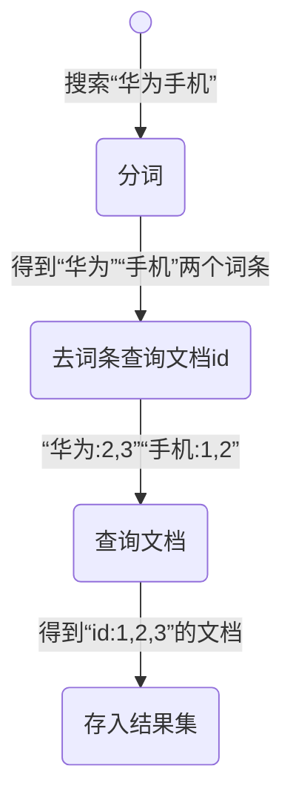
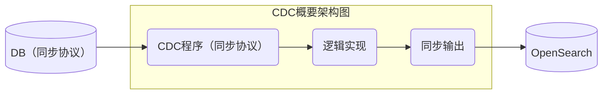

# OpenSearch

## 简介

OpenSearch 是一个由社区共同推动的 OpenSearch 与 Kibana 开源分支。  
该项目由 OpenSearch (fork OpenSearch 7.10.2) 和 OpenSearch Dashboards (fork Kibana 7.10.2) 组成，包括企业安全、告警、机器学习、SQL、索引状态管理等功能  
它是一个分布式、高扩展、高实时的搜索与数据分析引擎。能很方便的使大量数据，具有搜索、分析和探索的能力。  

## 官网和下载
 - [OpenSearch官网](https://opensearch.org/docs/latest/about/)
 - [Windows平台 v2.11.0 二进制(zip)](https://artifacts.opensearch.org/releases/bundle/opensearch/2.11.0/opensearch-2.11.0-windows-x64.zip)
 - [Windows平台安装教程](https://opensearch.org/docs/latest/install-and-configure/install-opensearch/windows/)
 - [Debian系下载安装教程](https://opensearch.org/docs/latest/install-and-configure/install-opensearch/debian/)

## Windows安装和服务启动
1. 下载好zip文件并且解压缩
2. 禁用安全性  
  在路径 ``opensearch-2.11.0\config`` 下找到 ``opensearch.yml``，添加设定
```
plugins.security.disabled: true
```
3. 运行根路径的 ``opensearch-windows-install.bat`` 启动服务
4. 运行命令测试
```
curl.exe -X GET http://localhost:9200
curl.exe -X GET http://localhost:9200/_cat/plugins?v
```
5. 到这里作为本地开发的话就可以使用了，如果想部署的话，看 [这里](https://opensearch.org/docs/latest/install-and-configure/install-opensearch/windows/#step-3-set-up-opensearch-in-your-environment)


**NOTE**：9300是tcp通信端口，集群之间使用tcp进行通信，9200是http协议端口

## OpenSearch的索引方式

OpenSearch 搜索引擎是基于 Lucene 的 ``倒排索引`` 实现的，索引的好处就是帮助我们快速检索到我们想要的数据。  
假设有表名为 ``product``，数据如下

| id | title          | price |
|----|----------------|-------|
| 1  | 小米手机       | 3499  |
| 2  | 华为手机       | 4999  |
| 3  | 华为小米充电器 | 49    |
| 4  | 小米手环       | 299   |

一般我们的数据库表会有id字段，并且id字段会被设置为主键索引，当我们查询语句为
```
select * from product where id = ?
```
此时查询会走索引（底层实现 ``B+树``），因此检索效率在数据比较多的情况下查询速度也是比较快的。

但是如果我们查询title列的每一行数据是否包含“手机”这一字段时，我们会用到模糊查询（即使title字段设置了索引，索引也不会生效
```
select * from product where title like %手机%
```
此时会进行逐行扫描，判断每一行的title列是否包含“手机”。如果表中的行数比较多，此时逐行扫描所要花费的时间是相当长的，因此查询效率会显得非常非常慢  
对于全文检索的查询方式，``倒排索引`` 可以解决这一难题

#### 倒排索引名词解释
 - 文档：表中的每一条记录（数据）就是一个文档
 - 词条：文档中按照语义划分成的词语就是词条
 - 索引：相同类型的文档的集合
 - 类型：表示数据结构，相当于表结构中描述字段的类型
 - 映射：索引中文档的字段约束信息，类似于表的信息

``product`` 表进行 ``倒排索引`` 后的结构为

| 词条(term) | 文档id  |
|------------|---------|
| 小米       | 1, 3, 4 |
| 手机       | 1, 2    |
| 华为       | 2, 3    |
| 充电器     | 3       |
| 手环       | 4       |

对于以上的表，无论有多少条文档，我们都可以根据语义划分的词条，形成 ``倒排索引`` 形式，如果文档中有重复词条出现，就在右边记录文档的id  

所以当前端用户输入 ``全文搜索内容`` 时，先 ``分词``，然后去词条找到 ``id`` 即可



查询的时候先根据词条查询到文档的id，然后再通过文档id找到想要的文档，两次查询均走索引。所以速度非常快  

在使用的时候，根据文档的类型，相同类型的文档会被划分到相同的索引库中。

 - 所有用户文档，就可以组织在一起，称为用户的索引
 - 所有商品的文档，可以组织在一起，称为商品的索引
 - 所有订单的文档，可以组织在一起，称为订单的索引

## DB 与 OpenSearch 结合
业务数据存储由关系型数据库负责，有强事务隔离机制，保障数据不丢失、不串乱、不覆盖，实时可靠。  
业务数据查询由 OpenSearch 负责，分库分表的数据合并同步到 OpenSearch 索引；跨领域库表数据合并到同步 OpenSearch 索引，这样就可以高效查询。  

#### 业务场景数据模型映射

 - 单数据表 -> 单索引  
 - 单数据表 ->多索引  
 - 多数据表 ->多索引  
 - 多源数据表 ->多索引  

#### 数据同步模式

 - 推送模式，数据源将变更数据推送到目标源，如RabbitMQ产品，服务端会主动MQ发送到客户端。

 - 拉取模式，目标源定时去数据源拉取变更数据，如Mysql数据库的数据主从同步机制，Slave会去Master拉取变更数据。

 - 推拉结合，数据源与目标源之间，既有推送方式，也有拉取方式，此种模式一般会借助于中间媒介实现，如基于Kafka产品的日志应用，数据源（采集端）会将日志数据发送到Kafka集群，目标源会定期的从Kafka拉取数据更新。

#### 数据同步方案

 - 同步双写，更新DB时同步更新ES。此技术方案最简单，附带问题最多，数据冲突，数据覆盖，数据丢失，处处是坑，谨慎选择。

 - 异步双写，更新DB之后，记录一条MQ，MQ通知消费端，消费端反向查询DB数据，最后更新到ES。此技术方案与业务系统耦合严重，需要更加业务需求独立编写，且每个业务都需要专门编写相关程序，非常不利于快速响应需求。

 - CDC，全称Change Data Capture，变更数据捕捉，从数据库内部捕捉变更数据，将变更数据推送到中间程序中，中间程序逻辑实现同步推送到ES。CDC机制速度极快，数据精准，且与应用程序耦合少，可抽象脱离业务系统，适合大规模使用。 如图：



**各个DB的CDC支持**
 - Postgresql 有 Logical Decoding。 [PGSync](https://github.com/toluaina/pgsync) 就是一个基于Logical Decoding的开源方案
 - Sqlserver 有 Change data capture 和 Change Tracking
 - Oralce 有 Redo log和 Oralce Golden Gate
 - Mysql 可以考虑 Flink CDC, Debezium
 - Mongodb 有 Replicate sets

## 其他
[ElasticSearch入门篇（保姆级教程）](https://www.cnblogs.com/coderxz/p/13268417.html)

<style>
    body {
        width: 70%;
    }
    table {
        border-collapse: collapse;
    }
    th {
        color: #ffffff;
        background: #373049;
    }
    th, td {
        border: 1px solid;
        padding: 8px;
    }
</style>
