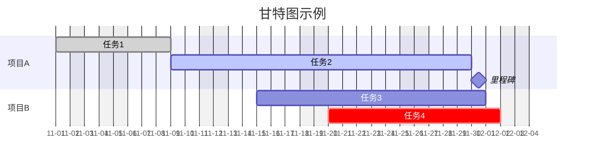
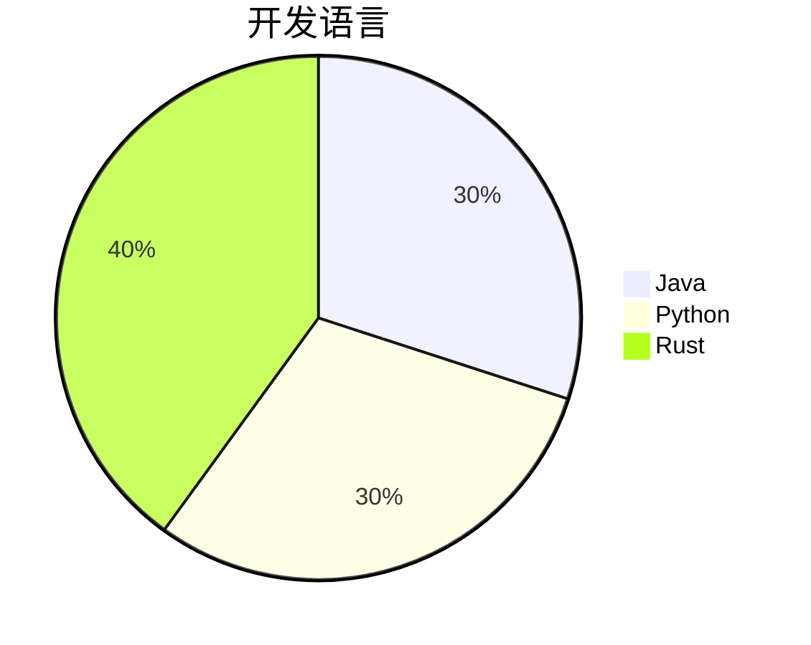
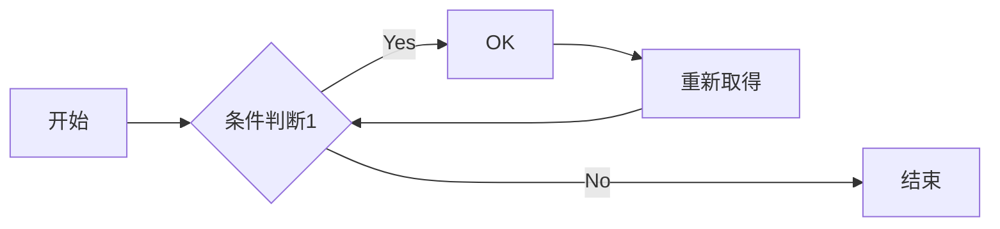
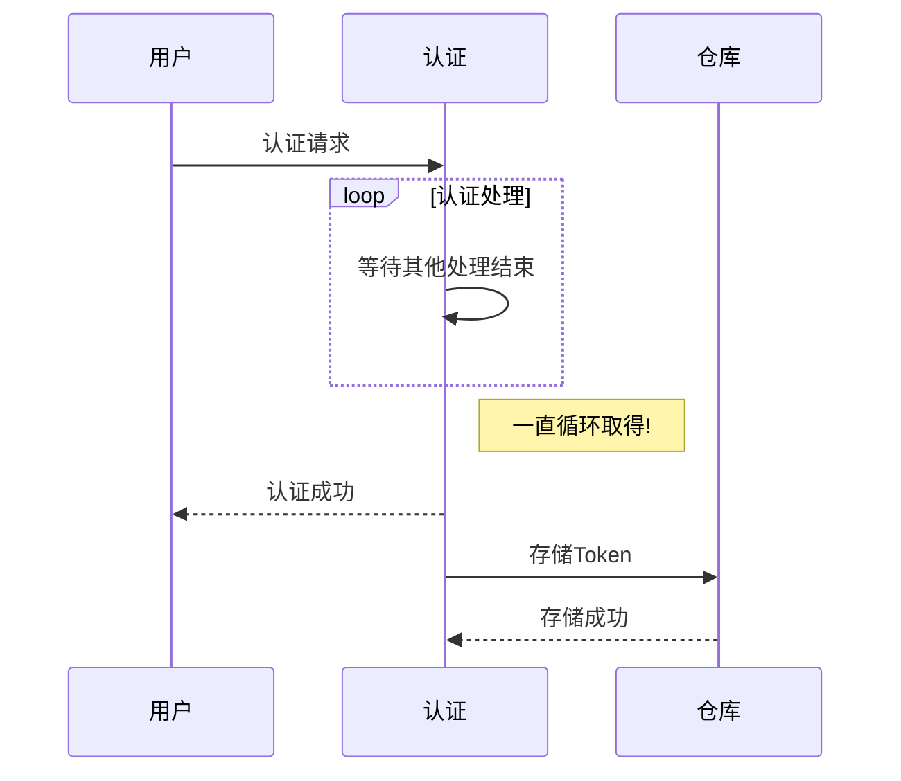

# 使用VSCode制作Markdown并且嵌入图片和流程图

## 需要工具
 - VSCode
 - [Markdown Preview Mermaid Support](https://marketplace.visualstudio.com/items?itemName=bierner.markdown-mermaid) 插件
 - [Draw.io Integration](https://marketplace.visualstudio.com/items?itemName=hediet.vscode-drawio) 插件

## 嵌入图片方法

### 基础写法
MarkDown 支持以 ``base64`` 的方式显示图片  
用 base64转码工具 把图片转成一段字符串，然后把字符串填到基础格式中链接的那个位置即可  
用法
```
![avatar][base64str_sample]

[base64str_sample]:data:image/png;base64,iVBORw0......
```
第一行是 Markdown 正文中需要导入图片的源码，``base64str_sample`` 可以理解为一个变量  
最下面一行是定义一个 ``base64str_sample`` 的变量，它的内容为 ``base64`` 的字符串，因为内容会很长，影响阅读，所以一般写到 Markdown 的最下面

### 使用Python将图片转化为base64字符串
新建 ``imgToBase64.py`` 内容如下
```
import base64
import sys

# 图片绝对路径-通过参数传递
img_file_path = sys.argv[1]
# 二进制方式打开图文件
# img_file = open('D:/Download/linglong.jpg', 'rb')
img_file = open(img_file_path, 'rb')
# 读取文件内容，转换为base64编码
base64code = base64.b64encode(img_file.read())
img_file.close()
# 将base64编码输出到控制台
print(base64code)
# 防止控制台闪退
input("请按任意键继续")
```
新建 ``imgToBase64.cmd`` 内容如下
```
set PYTHON_HOME=D:\Tools\WorkTool\Python\Python38-32
set PATH=%PATH%;%PYTHON_HOME%;%PYTHON_HOME%\Scripts
python D:\WorkSpace\Python\imgToBase64\imgToBase64.py %1
```
之后即可使用这个 cmd 命令来生成 base64  
比如
```
imgToBase64.cmd D:/Download/linglong.jpg
```
当然直接调用python也是可以的
```
python imgToBase64.py D:/Download/linglong.jpg
```
运行后会在控制台打印出如下内容
```
b'/9j/4QAYRXhpZgAASUkqAAgAAAAA...
...
AAAAAAf/Z'
请按任意键继续
```
两个 ``单引号之间`` 的内容即为 ``base64`` 替换到上面 基础写法中即可


### Python中base64字符串转化为图片
这部分代码暂时用不到，贴出来备用
```
import base64
bs='iVBORw0KGgoAAAANSUhEUg....' # 太长了省略
imgdata=base64.b64decode(bs)
file=open('2.jpg','wb')
file.write(imgdata)
file.close()
```
## 嵌入甘特图的方法（使用Mermaid）

### Mermaid简介
Mermaid是一个基于Javascript的绘图工具, 可以使用文本生成流程图、饼状图、甘特图等图表的描述语言，它可以帮助用户以简单、直观的方式创建各种类型的图表，包括流程图、时序图、甘特图等

- [Github地址](https://github.com/mermaid-js/mermaid)

### 各大服务支持
无论是在线服务：Github、Gitee  
还是搭建的私人服务器：Gogs、Gitea、GitLab  
都已经实现对 ``Mermaid`` 的内建支持

### 图表类型支持
 - **甘特图(Gantt Diagram)**
 - 饼形图(Pie Chart)
 - 流程图(Flow Chart)
 - 时序图(Sequence Diagram)
 - 状态图(State Diagram)
 - 类图(class Diagram)
 - 用户旅程图(Journey)

除此之外，Mermaid 还支持其他类型的图表，例如任务图（Task）和网路拓扑图（Network Topology），以及自定义的图表类型。Mermaid 的语法简单而灵活，可以让用户轻松地创建各种类型的图表

### 在VSCode的使用方法
在 VSCode 中打开一个 Markdown 文件，下载 ``Markdown Preview Mermaid Support`` 插件后，使用如下格式即可（前面不必有空格）
```
    ```mermaid
    stateDiagram
    [*] --> Active
    state Active {
        [*] --> NumLockOff
        NumLockOff --> NumLockOn : EvNumLockPressed
        NumLockOn --> NumLockOff : EvNumLockPressed
    }
    ```
```

### 用法示例

#### 甘特图(Gantt Diagram)
[官方帮助文档](http://mermaid.js.org/syntax/gantt.html)

```
    ```mermaid
gantt
%输入数据的时间格式
dateFormat YYYY-MM-DD
%坐标轴的时间格式
axisFormat %m-%d
%排除的时间
excludes weekends,2023-11-02
%坐标轴刻度，高版本支持
tickInterval 1day
%是否显示当天的标记，默认on
todayMarker on

title 甘特图示例
section 项目A
任务1           :done, a1, 2023-11-01, 5d
任务2           :active, a2, after a1, 15d
里程碑          :milestone, a3, 2023-11-30, 1d
section 项目B
任务3           :b1, 2023-11-15  , 12d
任务4           :crit, b2, 2023-11-20, 10d
    ```
```


#### 饼形图(Pie Chart)
```
    ```mermaid
pie
title 开发语言
"Java" : 30
"Python" : 30
"Rust" : 40
    ```
```


#### 流程图(Flow Chart)
```
    ```mermaid
graph LR
    A[开始] --> B{条件判断1};
    B -- Yes --> C[OK];
    C --> D[重新取得];
    D --> B;
    B -- No ----> E[结束];
    ```
```


#### 时序图(Sequence Diagram)
```
    ```mermaid
sequenceDiagram
% -->> 发送异步消息 ->>发送同步消息
用户->>认证: 认证请求
loop 认证处理
    认证->>认证: 等待其他处理结束
end
Note right of 认证: 一直循环取得!
认证-->>用户: 认证成功
认证->>仓库: 存储Token
仓库-->>认证: 存储成功
    ```
```


#### 连线样式
 - 右箭头：A --> B
 - 左箭头：A <-- B
 - 双向箭头：A <--> B
 - 右箭头带空心三角形：A --▷ B
 - 左箭头带实心三角形：A ◁-- B
 - 双向箭头带空心菱形：A --o B
 - 自我引用带圆形箭头：A ==> A
 - 粗体箭头：==>
 - 虚线箭头：-.->
 - 无箭头：---
 - A o--o B
 - B <--> C
 - C x--x D

### 命令行工具(mermaid-cli)
 - [Github地址](https://github.com/mermaid-js/mermaid-cli)

#### 安装
需要 ``Node`` 环境
```
npm install -g @mermaid-js/mermaid-cli
```

#### 用法
转换Mermaid mmd 文件到 SVG
```
mmdc -i input.mmd -o output.svg
```

#### 替换Markdown中的mermaid内容
```
mmdc -i readme.template.md -o readme.md
```


## 嵌入流程图的方法（使用SVG文件）

### SVG 简介
SVG，即可缩放矢量图形(Scalable Vector Graphics)，是一种 XML 应用，可以以一种简洁、可移植的形式表示图形信息。目前，人们对 SVG 越来越感兴趣。大多数现代浏览器都能显示 SVG 图形，并且大多数矢量绘图软件都能导出 SVG 图形。


### 使用 Draw.io 打开一个 svg 文件
可以新建一个空的，扩展名为 ``svg`` 的文件，然后用 VSCode 打开  
使用 Draw.io 插件画图后保存

### 使用文本编辑器打开 svg 文件
打开 ``svg`` 文件之后，可以得到 ``<svg>...</svg>`` 的 xml 代码

### 编辑 Markdown 文件
将上一步得到的 xml 代码直接复制到 md 文件即可

一个Markdown的示例
```
# 这是一个结构导图

<svg host="65bd71144e" xmlns="http://www.w3.org/2000/svg" xmlns:xlink="http://www.w3.org/1999/xlink" version="1.1" width="281px" height="191px" viewBox="-0.5 -0.5 281 191" content="&lt;mxfile&gt;&lt;diagram id=&quot;L-oKvDgklDFbDUm6tSgt&quot; name=&quot;第 1 页&quot;&gt;7VZNj5swEP01vgdICBxDQttDK1XKSj178SxYMhgZE0J+fcdgAoTNalf70UsvwLwZ2+P3ni2It8/P3xUts1+SgSDuip2JdyCu6zjeCl8GaXtkG7o9kCrObNEIHPkFLGjHpTVnUM0KtZRC83IOJrIoINEzjColm3nZkxTzVUuawgI4JlQs0T+c6axHA3c74j+Ap9mwsuOHfSanQ7HdSZVRJpsJ5MXE2yspdf+Vn/cgDHkDL/24b3ey18YUFPo1AyzvJypquzcS+2S3IqFD4g2JDmSHyJZEEQk9kwpjEqxt77odCKkangtaYBRVmiptJcPFvSiTil9koalAxEEgybhgP2kra9OiVgBDMKl9QBizZgIFFb/QRzHEiSngBaiHtgQ7A8JPCNt1HeQxsjsDpeF8lx3nyjmaFWQOWrVYYge4vpWpHfxn42ZU3Q0slk0VDy1IrdPS69yjGPhh9XheG++eNlFI4oAEOxJ02uAzCheSNBnXcCxpYuIGz6GhV+eDCK9ix32RnXBOznrJzZWvKTfrD6Bm/Qw1G7I7EOxpQY3zD7hxb4zjfSE5myU5twQAw/vMhiAeZROPQNQBmDAE8MQc2yk5StYFAzac5VqdusAczErWKoHfoDj2DMoQzIvUJvFaSEHfSU4vDd+0ULBJ1Ldven5ZDdxi18Hs+PTrTmyz1EyBoJqf5rO/RwH/LfZcqvP59nRuL7av9Of2vz/v+NP/HH9iOP5RdLnJf5kX/wU=&lt;/diagram&gt;&lt;/mxfile&gt;">
    <defs/>
    <g>
        <path d="M 0 20 L 0 0 L 280 0 L 280 20" fill="rgb(255, 255, 255)" stroke="rgb(0, 0, 0)" stroke-miterlimit="10" pointer-events="all"/>
        <path d="M 0 20 L 0 190 L 280 190 L 280 20" fill="none" stroke="rgb(0, 0, 0)" stroke-miterlimit="10" pointer-events="none"/>
        <path d="M 0 20 L 280 20" fill="none" stroke="rgb(0, 0, 0)" stroke-miterlimit="10" pointer-events="none"/>
        <g fill="rgb(0, 0, 0)" font-family="Helvetica" font-weight="bold" pointer-events="none" text-anchor="middle" font-size="12px">
            <text x="139.5" y="14.5">
                树形结构
            </text>
        </g>
        <rect x="90" y="40" width="100" height="40" fill="rgb(255, 255, 255)" stroke="rgb(0, 0, 0)" pointer-events="none"/>
        <g transform="translate(-0.5 -0.5)">
            <switch>
                <foreignObject pointer-events="none" width="100%" height="100%" requiredFeatures="http://www.w3.org/TR/SVG11/feature#Extensibility" style="overflow: visible; text-align: left;">
                    <div xmlns="http://www.w3.org/1999/xhtml" style="display: flex; align-items: unsafe center; justify-content: unsafe center; width: 98px; height: 1px; padding-top: 60px; margin-left: 91px;">
                        <div data-drawio-colors="color: rgb(0, 0, 0); " style="box-sizing: border-box; font-size: 0px; text-align: center;">
                            <div style="display: inline-block; font-size: 12px; font-family: Helvetica; color: rgb(0, 0, 0); line-height: 1.2; pointer-events: none; white-space: normal; overflow-wrap: normal;">
                                根节点
                            </div>
                        </div>
                    </div>
                </foreignObject>
                <text x="140" y="64" fill="rgb(0, 0, 0)" font-family="Helvetica" font-size="12px" text-anchor="middle">
                    根节点
                </text>
            </switch>
        </g>
        <rect x="20" y="130" width="100" height="40" fill="rgb(255, 255, 255)" stroke="rgb(0, 0, 0)" pointer-events="none"/>
        <g transform="translate(-0.5 -0.5)">
            <switch>
                <foreignObject pointer-events="none" width="100%" height="100%" requiredFeatures="http://www.w3.org/TR/SVG11/feature#Extensibility" style="overflow: visible; text-align: left;">
                    <div xmlns="http://www.w3.org/1999/xhtml" style="display: flex; align-items: unsafe center; justify-content: unsafe center; width: 98px; height: 1px; padding-top: 150px; margin-left: 21px;">
                        <div data-drawio-colors="color: rgb(0, 0, 0); " style="box-sizing: border-box; font-size: 0px; text-align: center;">
                            <div style="display: inline-block; font-size: 12px; font-family: Helvetica; color: rgb(0, 0, 0); line-height: 1.2; pointer-events: none; white-space: normal; overflow-wrap: normal;">
                                子节点1
                            </div>
                        </div>
                    </div>
                </foreignObject>
                <text x="70" y="154" fill="rgb(0, 0, 0)" font-family="Helvetica" font-size="12px" text-anchor="middle">
                    子节点1
                </text>
            </switch>
        </g>
        <path d="M 140 80 L 140 95 Q 140 105 130 105 L 80 105 Q 70 105 70 114.32 L 70 123.63" fill="none" stroke="rgb(0, 0, 0)" stroke-miterlimit="10" pointer-events="none"/>
        <path d="M 70 128.88 L 66.5 121.88 L 70 123.63 L 73.5 121.88 Z" fill="rgb(0, 0, 0)" stroke="rgb(0, 0, 0)" stroke-miterlimit="10" pointer-events="none"/>
        <rect x="160" y="130" width="100" height="40" fill="rgb(255, 255, 255)" stroke="rgb(0, 0, 0)" pointer-events="none"/>
        <g transform="translate(-0.5 -0.5)">
            <switch>
                <foreignObject pointer-events="none" width="100%" height="100%" requiredFeatures="http://www.w3.org/TR/SVG11/feature#Extensibility" style="overflow: visible; text-align: left;">
                    <div xmlns="http://www.w3.org/1999/xhtml" style="display: flex; align-items: unsafe center; justify-content: unsafe center; width: 98px; height: 1px; padding-top: 150px; margin-left: 161px;">
                        <div data-drawio-colors="color: rgb(0, 0, 0); " style="box-sizing: border-box; font-size: 0px; text-align: center;">
                            <div style="display: inline-block; font-size: 12px; font-family: Helvetica; color: rgb(0, 0, 0); line-height: 1.2; pointer-events: none; white-space: normal; overflow-wrap: normal;">
                                子节点2
                            </div>
                        </div>
                    </div>
                </foreignObject>
                <text x="210" y="154" fill="rgb(0, 0, 0)" font-family="Helvetica" font-size="12px" text-anchor="middle">
                    子节点2
                </text>
            </switch>
        </g>
        <path d="M 140 80 L 140 95 Q 140 105 150 105 L 200 105 Q 210 105 210 114.32 L 210 123.63" fill="none" stroke="rgb(0, 0, 0)" stroke-miterlimit="10" pointer-events="none"/>
        <path d="M 210 128.88 L 206.5 121.88 L 210 123.63 L 213.5 121.88 Z" fill="rgb(0, 0, 0)" stroke="rgb(0, 0, 0)" stroke-miterlimit="10" pointer-events="none"/>
    </g>
    <switch>
        <g requiredFeatures="http://www.w3.org/TR/SVG11/feature#Extensibility"/>
        <a transform="translate(0,-5)" xlink:href="https://www.diagrams.net/doc/faq/svg-export-text-problems" target="_blank">
            <text text-anchor="middle" font-size="10px" x="50%" y="100%">
                Text is not SVG - cannot display
            </text>
        </a>
    </switch>
</svg>

# 下一步...
```